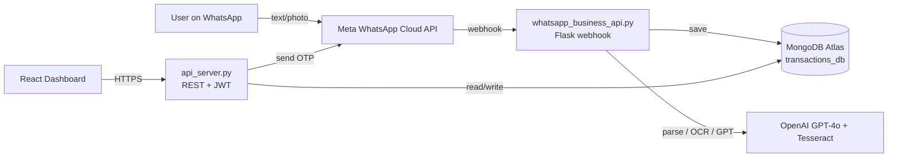

# Flow — Smart Cash Flow Management via WhatsApp

> **Take control of your cash flow.** Flow is an AI‑powered financial
> management platform that lets individuals and small businesses record income,
> expenses, and receipts simply by sending a WhatsApp message — and review
> everything through a clean web dashboard.

[](https://www.python.org/)
[](https://flask.palletsprojects.com/)
[](https://react.dev/)
[](https://www.mongodb.com/atlas)
[](LICENSE)

---

## Table of Contents

1. [What is Flow?](#what-is-flow)
2. [Who is it for?](#who-is-it-for)
3. [Key Features](#key-features)
4. [How it Works](#how-it-works)
5. [Architecture](#architecture)
6. [Quick Start for End Users](#quick-start-for-end-users)
7. [WhatsApp Commands & Examples](#whatsapp-commands--examples)
8. [Web Dashboard](#web-dashboard)
9. [Developer Setup](#developer-setup)
10. [Configuration (.env)](#configuration-env)
11. [Project Structure](#project-structure)
12. [API Reference](#api-reference)
13. [Testing](#testing)
14. [Deployment](#deployment)
15. [Security & Privacy](#security--privacy)
16. [Roadmap](#roadmap)
17. [Contributing](#contributing)
18. [Support](#support)
19. [License](#license)

---

## What is Flow?

**Flow** (formerly *Aliran Tunai*, Malay for *"Cash Flow"*) is an end‑to‑end
financial management system that combines:

- A **WhatsApp Business API bot** that understands natural language (English
  and Malay) and reads photos of receipts using AI vision and OCR.
- A **Flask REST API** that stores transactions in MongoDB, computes financial
  health metrics, and exposes data to the dashboard.
- A **React + Vite web dashboard** (deployed at
  [flow-ai.biz](https://flow-ai.biz)) for visualising cash flow, reviewing
  transactions, exporting Excel reports, and managing accounts.
- A **contractor claim workflow** with stamp verification and MyInvois
  (UBL 2.1) e‑invoice generation for Malaysia.

You don't need to install anything to use it — just message the WhatsApp
number and log in to the web dashboard with your phone number and an OTP.

## Who is it for?

| User                     | What they get                                                                 |
| ------------------------ | ----------------------------------------------------------------------------- |
| **Individuals**          | Personal expense and income tracking, budget summaries, savings insights.      |
| **Micro & SMEs**         | Sales, purchases, payments, customer/vendor tracking, AI category coding.      |
| **Contractors / Vendors**| Submit stamped receipts, generate compliant e‑invoices, get paid faster.       |
| **Accountants**          | Export ready‑to‑audit Excel reports per user, per transaction type.            |

## Key Features

### Conversational entry (WhatsApp)
- Bilingual NLP (Malay + English) — auto‑detects language per message.
- Free‑text transactions: *"Sold 50 bags of rice to ABC Trading on credit RM2,500"*.
- Receipt photo upload — OCR + GPT‑4o vision extract vendor, items, totals.
- Pending‑transaction clarification: bot asks follow‑up questions for missing fields.
- Personal mode and Business mode (switch per user).
- Daily streak tracking and gentle nudges.

### Financial intelligence
- **Cash Conversion Cycle (CCC)** with DSO, DIO, DPO breakdown.
- AI‑powered expense categorisation (OPEX, CAPEX, COGS, INVENTORY, MARKETING, UTILITIES).
- Income vs. expense detection from natural text.
- Per‑user totals, recent activity, and trend charts.

### Web dashboard
- Phone‑number login with WhatsApp‑delivered OTP and JWT sessions.
- Cash flow overview, recent transactions, drill‑down, edit, delete.
- Excel export (all transactions, sales only, purchases only).
- Reports page with charts (Recharts).
- White‑label / multi‑brand theming via environment variables (the same
  codebase powers the *Aliran Tunai* and *Flow* deployments).

### Contractor claims ([contractor_claim.py](contractor_claim.py))
- Verifies that a scanned receipt carries an official stamp.
- Generates a UBL 2.1 (MyInvois‑compatible) e‑invoice JSON.
- Saves to `transactions_db.activity` with payment confirmation tracking.

### Operations
- Rate limiting and malicious‑request filtering at the API edge.
- Health‑check script and PM2 / systemd deployment configs.
- Nginx reverse‑proxy config and EC2 deploy script.

## How it Works



1. The user sends a WhatsApp message or receipt photo.
2. Meta's Cloud API forwards it to the `/whatsapp/webhook` endpoint.
3. The bot detects language, parses the transaction (regex fast‑path or AI
   fallback), and stores it in MongoDB — replying immediately for a snappy UX.
4. The user opens [flow-ai.biz](https://flow-ai.biz), logs in with their
   phone number + WhatsApp OTP, and reviews everything in the dashboard.

## Architecture

| Layer            | Technology                                                                  |
| ---------------- | --------------------------------------------------------------------------- |
| Messaging        | WhatsApp Business Cloud API (Meta Graph v18)                                |
| Bot service      | Python 3.12, Flask, OpenAI SDK, pytesseract, Pillow / OpenCV                |
| REST API         | Python 3.12, Flask, Flask‑CORS, Flask‑JWT‑Extended, PyJWT                   |
| Database         | MongoDB Atlas (collections: `entries`, `users`, `otp_codes`, `activity`)    |
| AI               | OpenAI GPT‑4o / GPT‑4o‑mini (text + vision), Tesseract OCR                  |
| Frontend         | React 19, Vite 7, React Router 7, TanStack Query, Tailwind CSS 4, Recharts  |
| Auth             | Phone + WhatsApp OTP → JWT (30‑day expiry)                                  |
| Reports          | pandas + xlsxwriter Excel exports                                           |
| Process manager  | PM2 ([ecosystem.config.js](ecosystem.config.js)) and systemd ([deploy/](deploy)) |
| Reverse proxy    | Nginx ([nginx-aliran-tunai.conf](nginx-aliran-tunai.conf))                  |
| Hosting          | AWS EC2 (backend), Vercel (frontend)                                        |

---

## Quick Start for End Users

> No installation required — Flow runs as a hosted service.

### 1. Save the WhatsApp number
Add the official Flow WhatsApp Business number to your contacts. (Ask the
operator for the current number, or scan the QR code on
[flow-ai.biz](https://flow-ai.biz).)

### 2. Say hello
Send `start` (or `mula`, `hi`, `hello`). The bot will:
- Detect your language (English or Malay).
- Walk you through a short registration: your name, business name (optional),
  and whether you want **Personal** or **Business** mode.

### 3. Record your first transaction
Just type naturally:

```
Bought office supplies from Mr. DIY for RM45 cash
```

or send a photo of a receipt. The bot replies with a confirmation card and
saves the entry instantly.

### 4. Open the dashboard
1. Visit **https://flow-ai.biz**.
2. Enter your WhatsApp phone number.
3. You'll receive a 6‑digit OTP via WhatsApp — enter it to log in.
4. Explore your cash flow, drill into transactions, and export Excel reports.

### 5. Daily workflow
- Snap receipts → send them to the bot.
- Type sales/expenses as they happen.
- Type `status` for a quick health check.
- Type `summary` for your latest entries.
- Type `streak` to see your consecutive‑day streak.

> **Tip:** You can mix English and Malay freely — the bot handles both.

---

## WhatsApp Commands & Examples

| Command              | What it does                                                  |
| -------------------- | ------------------------------------------------------------- |
| `/start` or `start`  | Welcome message + onboarding (mode‑aware).                    |
| `/help` or `help`    | Usage guide in your detected language.                        |
| `/status`            | Cash flow health report with CCC, DSO, DIO, DPO, advice.      |
| `/summary`           | Latest transactions for your account.                         |
| `/streak`            | Your daily logging streak.                                    |
| `/test_db`           | Diagnostic — confirm your account is reachable in the DB.     |
| `reset` / `tetap semula` | Start the account‑reset confirmation flow.                |

### Example messages

**Business — sale on credit (English):**
```
Sold 10 cartons of bottled water to Pak Mat Sundry for RM320 on credit
```

**Business — purchase with cash (Malay):**
```
Beli stok kicap dari Pasar Borong RM180 tunai
```

**Personal — expense:**
```
Lunch at McD RM18.50
```

**Receipt photo:** simply send the JPEG/PNG of your receipt — the bot replies
with extracted vendor, items, totals, and saves it.

---

## Web Dashboard

Routes ([frontend/src/main.jsx](frontend/src/main.jsx)):

| Path              | Page             | Auth |
| ----------------- | ---------------- | ---- |
| `/`               | Smart redirect   | —    |
| `/landing`        | Marketing page   | —    |
| `/login`          | Phone + OTP      | —    |
| `/dashboard`      | Cash flow & KPIs | ✅    |
| `/transactions`   | List / edit / delete | ✅ |
| `/privacy-policy` | Privacy policy   | —    |
| `/brand-preview`  | Theme preview    | —    |

The frontend is white‑label ready — every brand colour, logo, and meta tag is
controlled by `VITE_BRAND_*` environment variables (see
[frontend/src/config/brand.js](frontend/src/config/brand.js)).

---

## Developer Setup

### Prerequisites

- **Python** 3.12 (see [runtime.txt](runtime.txt))
- **Node.js** 18+ and npm
- **MongoDB** Atlas account (or local `mongod`)
- **Tesseract OCR** installed on the host
- **OpenAI** API key
- **Meta WhatsApp Business Cloud API** app (Phone Number ID + permanent token)
- **Twilio** account (optional — only used if you enable Twilio fallback)

#### Install Tesseract

```bash
# macOS
brew install tesseract

# Ubuntu / Debian
sudo apt-get install -y tesseract-ocr tesseract-ocr-eng
```

### 1. Clone the repository

```bash
git clone https://github.com/maercaestro/aliran-tunai.git
cd aliran-tunai
```

### 2. Backend (Python)

```bash
python3.12 -m venv aliran
source aliran/bin/activate              # Windows: aliran\Scripts\activate
pip install -r requirements.txt
cp .env.example .env                    # then edit values (see below)
```

Run the two backend services in separate terminals:

```bash
# Terminal 1 — REST API (port 5000)
python api_server.py

# Terminal 2 — WhatsApp webhook (port 8443 by default)
python whatsapp_business_api.py
```

For local WhatsApp testing, expose the webhook with **ngrok** or **cloudflared**:

```bash
ngrok http 8443
# Copy the HTTPS URL into Meta → WhatsApp → Configuration → Callback URL
# Append: /whatsapp/webhook
```

### 3. Frontend (React + Vite)

```bash
cd frontend
npm install
npm run dev          # http://localhost:5173
```

The dev server proxies API calls to `http://localhost:5000` in development;
production uses `https://api.aliran-tunai.com` (see
[frontend/src/config/api.js](frontend/src/config/api.js)).

### 4. Build for production

```bash
cd frontend
npm run build        # outputs to frontend/dist
```

---

## Configuration (.env)

Create a `.env` file in the project root with the following keys:

```env
# === MongoDB ===
MONGO_URI=mongodb+srv://<user>:<pass>@<cluster>/?retryWrites=true&w=majority

# === OpenAI ===
OPENAI_API_KEY=sk-...

# === WhatsApp Business Cloud API ===
WHATSAPP_ACCESS_TOKEN=EAA...
WHATSAPP_PHONE_NUMBER_ID=123456789012345
WHATSAPP_BUSINESS_ACCOUNT_ID=123456789012345
WHATSAPP_API_VERSION=v18.0
WHATSAPP_VERIFY_TOKEN=your_random_verify_token

# === Auth ===
JWT_SECRET_KEY=replace-with-a-long-random-string

# === Webhook (local dev) ===
WEBHOOK_URL=https://<your-ngrok-id>.ngrok.io/whatsapp/webhook
WEBHOOK_PORT=8443

# === Optional: legacy Telegram bot ===
TELEGRAM_TOKEN=

# === Frontend (frontend/.env) ===
VITE_BRAND_NAME=Flow
VITE_BRAND_LOGO_PATH=/final-logo.png
VITE_BRAND_COLOR_PRIMARY=#00F0B5
```

The [scripts/validate_environment.py](scripts/validate_environment.py) helper
checks that all required variables are present.

---

## Project Structure

```
aliran-tunai/
├── api_server.py               # Flask REST API (dashboard backend, OTP, JWT)
├── whatsapp_business_api.py    # WhatsApp webhook + bot logic, OCR, AI parsing
├── contractor_claim.py         # Receipt stamp verification + MyInvois e-invoice
├── webhook_manager.py          # CLI helper to set / delete the webhook
├── reset_registration.py       # Admin utility to reset a user
├── quick_reset.py              # Quick local reset helper
├── requirements.txt            # Python dependencies
├── runtime.txt                 # Python version pin (3.12)
├── ecosystem.config.js         # PM2 process definition
├── nginx-aliran-tunai.conf     # Nginx reverse-proxy config
├── deploy/                     # systemd units + deploy.sh + nginx.conf
│   ├── aliran-api-server.service
│   ├── aliran-tunai.service
│   ├── aliran-whatsapp.service
│   ├── deploy.sh
│   ├── nginx.conf
│   └── setup_monitoring.sh
├── scripts/
│   ├── health_check.py         # End-to-end health probe
│   ├── security-check.sh       # Static security checks
│   └── validate_environment.py # .env validator
├── tests/                      # Pytest suites (regex, OCR, multilanguage, etc.)
├── integration_tests/
│   └── test_integration.py
└── frontend/                   # React + Vite dashboard
    ├── src/
    │   ├── pages/              # LandingPage, Login, Dashboard, Transactions, ...
    │   ├── components/         # AddTransactionModal, ReportsPage, SettingsModal, ...
    │   ├── api/                # axios client + workOrders
    │   ├── config/             # api.js, brand.js
    │   └── contexts/           # AuthContext
    ├── vite.config.js
    └── package.json
```

---

## API Reference

All API endpoints are served by [api_server.py](api_server.py) (default port
`5000`, production `https://api.aliran-tunai.com`). Authenticated endpoints
require `Authorization: Bearer <jwt>`.

### Authentication

| Method | Endpoint                  | Description                                  |
| ------ | ------------------------- | -------------------------------------------- |
| POST   | `/api/auth/send-otp`      | Send a 6‑digit OTP via WhatsApp.             |
| POST   | `/api/auth/verify-otp`    | Verify OTP, returns JWT.                     |

### Dashboard & data

| Method | Endpoint                                 | Description                              |
| ------ | ---------------------------------------- | ---------------------------------------- |
| GET    | `/api/dashboard/stats`                   | Aggregate stats for the current user.    |
| GET    | `/api/dashboard/<wa_id>`                 | Per‑user dashboard payload (CCC etc.).   |
| GET    | `/api/personal-budget/<wa_id>`           | Personal mode budget summary.            |
| GET    | `/api/transactions`                      | List for the authenticated user.         |
| GET    | `/api/transactions/<user_id>`            | List for a given WhatsApp ID.            |
| POST   | `/api/transactions`                      | Create a transaction.                    |
| PUT    | `/api/transactions/<transaction_id>`     | Update a transaction.                    |
| DELETE | `/api/transactions/<transaction_id>`     | Delete a transaction.                    |
| POST   | `/api/categorize`                        | AI categorisation of a description.      |
| GET    | `/api/users`                             | (Admin) list users.                      |

### Reports

| Method | Endpoint                                       | Description                       |
| ------ | ---------------------------------------------- | --------------------------------- |
| GET    | `/api/download-excel/<wa_id>`                  | All transactions as `.xlsx`.      |
| GET    | `/api/download-excel/<wa_id>/sale`             | Sales only.                       |
| GET    | `/api/download-excel/<wa_id>/purchase`         | Purchases only.                   |

### Operations

| Method | Endpoint                       | Description                                      |
| ------ | ------------------------------ | ------------------------------------------------ |
| GET    | `/api/health`                  | Liveness + DB connectivity probe.                |
| GET    | `/api/debug/connection`        | Verbose connection diagnostics.                  |
| GET    | `/api/debug/whatsapp-config`   | Validate WhatsApp credentials.                   |
| POST   | `/api/debug/test-whatsapp`     | Send a test WhatsApp message.                    |

### WhatsApp webhook ([whatsapp_business_api.py](whatsapp_business_api.py))

| Method | Endpoint              | Description                                |
| ------ | --------------------- | ------------------------------------------ |
| GET    | `/whatsapp/webhook`   | Meta verification challenge.               |
| POST   | `/whatsapp/webhook`   | Inbound messages and status callbacks.     |
| GET    | `/health`             | Webhook service liveness.                  |

---

## Testing

```bash
# Activate the virtualenv first
source aliran/bin/activate

# Unit tests
pytest tests/ -v

# Integration tests (requires running services + .env)
pytest integration_tests/ -v

# Health check
python scripts/health_check.py

# Frontend lint
cd frontend && npm run lint
```

The test suite covers regex parsing, multilanguage detection, OCR pipeline,
WhatsApp API helpers, MongoDB integration, the contractor claim workflow,
and end‑to‑end transaction flow.

---

## Deployment

### Option A — Single EC2 instance (recommended)

```bash
# On a fresh Ubuntu 22.04 EC2:
git clone https://github.com/maercaestro/aliran-tunai.git
cd aliran-tunai
chmod +x deploy/deploy.sh
./deploy/deploy.sh
```

[deploy/deploy.sh](deploy/deploy.sh) installs Python 3.12, Tesseract, Nginx,
certbot, and the three systemd services:

- `aliran-api-server.service` — Flask REST API on `127.0.0.1:5000`.
- `aliran-whatsapp.service` — WhatsApp webhook on `127.0.0.1:8443`.
- `aliran-tunai.service` — legacy Telegram process (optional).

Nginx ([deploy/nginx.conf](deploy/nginx.conf) or
[nginx-aliran-tunai.conf](nginx-aliran-tunai.conf)) terminates TLS and
proxies `api.aliran-tunai.com` → API and `/whatsapp/webhook` → bot.

### Option B — PM2

```bash
npm install -g pm2
pm2 start ecosystem.config.js
pm2 save && pm2 startup
```

### Frontend

The React app is hosted on **Vercel** ([frontend/vercel.json](frontend/vercel.json)).
Push to the `main` branch — Vercel builds and deploys automatically. Set the
`VITE_BRAND_*` env vars in the Vercel project to white‑label.

### Post‑deploy checks

```bash
python scripts/health_check.py
curl https://api.aliran-tunai.com/api/health
```

---

## Security & Privacy

- **Per‑user isolation** — data is partitioned by `wa_id` (WhatsApp ID).
- **JWT** sessions with 30‑day expiry, signed with `JWT_SECRET_KEY`.
- **OTP** delivered via WhatsApp Authentication Template (no SMS leakage).
- **CORS** restricted to known origins (`aliran-tunai.com`, `flow-ai.biz`,
  localhost dev ports).
- **Rate limiting** — 200 req/min/IP at the Flask edge.
- **Malicious path filter** blocks scans for `/wp-`, `/phpmyadmin`, `.php`,
  `.asp`, etc.
- **Receipt images** are stored as base64 inside the user's own document.
- **Stamp verification** in [contractor_claim.py](contractor_claim.py) prevents
  fraudulent claims.
- See [scripts/security-check.sh](scripts/security-check.sh) for static audits.

> **Never commit `.env`** — it is gitignored. Rotate `OPENAI_API_KEY`,
> `WHATSAPP_ACCESS_TOKEN`, and `JWT_SECRET_KEY` if they leak.

---

## Roadmap

- [ ] Multi‑currency support
- [ ] Recurring transactions and reminders
- [ ] Bank statement import (CSV / OFX)
- [ ] MyInvois live submission (currently generates UBL only)
- [ ] iOS / Android wrapper apps
- [ ] Team / multi‑user accounts with roles

---

## Contributing

Pull requests are welcome. For major changes, please open an issue first to
discuss what you'd like to change.

1. Fork the repo and create a feature branch.
2. Add tests under [tests/](tests).
3. Run `pytest` and `npm run lint` — keep both green.
4. Submit a PR with a clear description and screenshots if UI is affected.

---

## Support

- Web: [https://flow-ai.biz](https://flow-ai.biz)
- Issues: [GitHub Issues](https://github.com/maercaestro/aliran-tunai/issues)
- Repo: [github.com/maercaestro/aliran-tunai](https://github.com/maercaestro/aliran-tunai)
- Email: support@flow-ai.biz

If you're a **potential user** filling out the survey accompanying this
README, please share:
- What financial admin currently takes most of your time?
- Which feature in the [Key Features](#key-features) list is most useful to you?
- Anything you wish Flow could do that it doesn't?

---

## License

Released under the [MIT License](LICENSE) © 2025 Abu Huzaifah Bin Haji Bidin.

---

**Made with ❤️ to make cash flow management effortless for everyone.**
